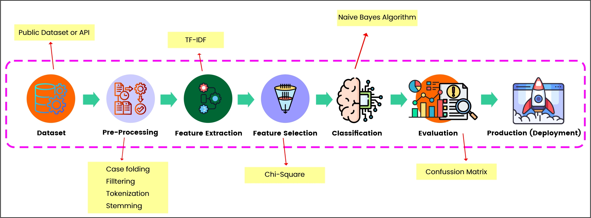
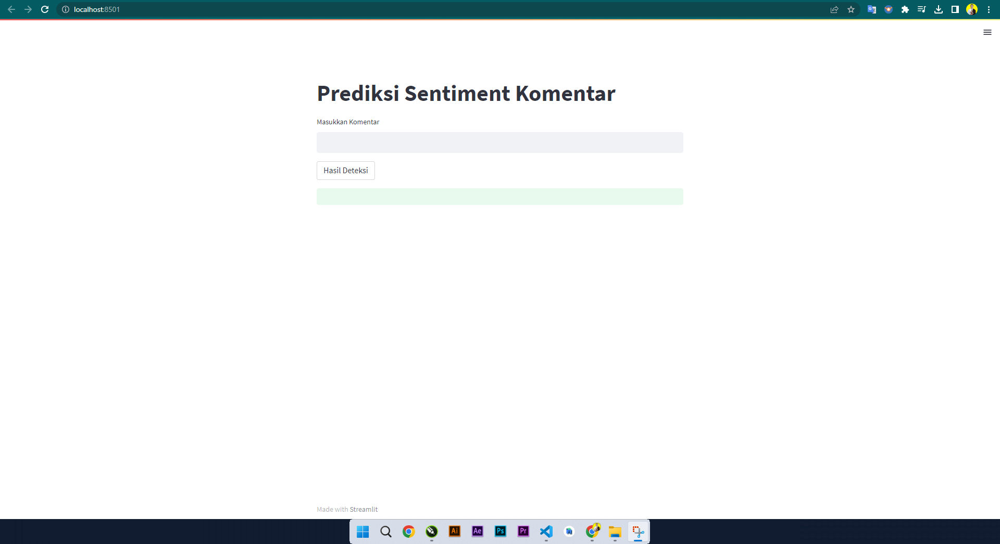

# Analisis Sentimen Komentar Instagram

Analisis sentimen komentar instagram berbahasa Indonesia menggunakan algoritma naive bayes classifier





## Documentation

- [Dataset Source](https://github.com/rizalespe/Dataset-Sentimen-Analisis-Bahasa-Indonesia)
- Text Pre-Processing 
    - Case Folding
    - Filltering
    - Tokenization
    - Stemming
- Feature Extraction
    - TF-IDF
- Feature Selection
    - Chi-Square
- Classification
    - Naive Bayes Classification
- Evaluation
    - Confussion Matrix -> akurasi model 95%
- Production
    - Streamlit
    
 


## Run Locally

Clone the project

```bash
  git clone https://github.com/RaisJaya/Analysis-Seniment-Komentar-Instagram_Algoritma-NaiveBayes
```

Go to the project directory

```bash
  cd Analysis-Seniment-Komentar-Instagram_Algoritma-NaiveBayes
```

Install dependencies

```bash
  pip install streamlit
```

Start the server

```bash
  streamlit run stream_sentiment-analysis.py
```


## Preview




## Disadvantages

Not yet using real-time datasets with multi languages and there is no visualization of the latest sentiment trend data so there is no interactive dashboard to monitor comment sentiment


## Authors

- [@Raisjaya](https://www.github.com/Raisjaya)
- [ahmad.rdj2@gmail.com](mailto:ahmad.rdj2@gmail.com)
